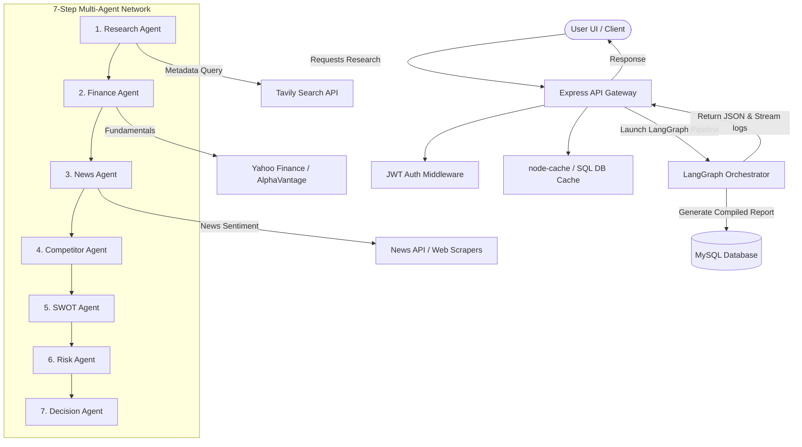

# InvestIQ - AI Investment Research Agent Dashboard

InvestIQ is a premium, production-grade AI Investment Research Dashboard that orchestrates a multi-agent system powered by LangChain.js to perform comprehensive security analysis. It generates professional, institutional-grade equity research reports complete with detailed financial modeling, SWOT assessments, competitor comparisons, risks, sentiment scores, and investment recommendations.

---

## Architecture Diagram



---

## Folder Structure

```text
InvestIQ/
├── backend/
│   ├── config/              # Database connection, API configurations
│   ├── controllers/         # Request handling (Auth, Research, Dashboard, etc.)
│   ├── langchain/           # LangGraph structure, prompts, and agent nodes
│   ├── middlewares/         # JWT auth, rate limiter, validators, error handler
│   ├── models/              # Database query logic
│   ├── routes/              # Express endpoint paths
│   ├── services/            # Finance, News, Cache, and AI runner services
│   ├── utils/               # PDF Export and Logger utilities
│   ├── server.js            # Express server entry point
│   └── package.json
│
├── frontend/
│   ├── public/              # Static public assets
│   ├── src/
│   │   ├── components/      # UI components (Charts, Sidebar, Modals, Loaders)
│   │   ├── context/         # Auth, Theme, and Language contexts
│   │   ├── pages/           # Landing, Auth, Dashboard, Research, Settings
│   │   ├── services/        # Axios API client handlers
│   │   ├── App.jsx          # Route paths
│   │   ├── index.css        # Global CSS with custom glassmorphism styles
│   │   └── main.jsx
│   ├── tailwind.config.js   # Tailwinds color theme variables
│   ├── vite.config.js
│   └── package.json
│
├── database/
│   └── schema.sql           # MySQL Table definitions
│
├── .env.example             # Environment variable template
└── README.md                # System Documentation
```

---

## API Documentation

### Authentication Endpoints
- `POST /api/auth/register` - Create a new user account.
- `POST /api/auth/login` - Authenticate credentials and receive a JWT.
- `GET /api/auth/profile` - Fetch current user's profile info.
- `PUT /api/auth/profile` - Update user avatar/details.

### Research & Reports
- `POST /api/research` - Initiates the LangGraph analysis for a company/ticker.
- `GET /api/history` - Fetches the user's historical research list.
- `GET /api/report/:id` - Retrieves a completed research report by ID.
- `DELETE /api/report/:id` - Deletes a research report.
- `POST /api/save-report` - Saves a research report to bookmarks.

### Dashboard & Settings
- `GET /api/dashboard` - Fetches usage statistics, charts, and summaries.
- `GET /api/bookmarks` - Lists all user bookmarked companies.
- `POST /api/bookmark` - Adds a company to the user's watchlist.
- `DELETE /api/bookmark/:id` - Removes a company from bookmarks.
- `PUT /api/settings` - Saves UI theme and notification settings.

---

## Installation & Setup

### Prerequisites
- Node.js (v18+)
- MySQL Server (optional, runs using SQLite local fallback if MySQL is unavailable)

### 1. Database Setup
Log into your MySQL instance and run the schema file:
```bash
mysql -u root -p < database/schema.sql
```

### 2. Environment Configuration
Copy the `.env.example` file and fill in your keys:
```bash
cp .env.example .env
```

### 3. Backend Setup
```bash
cd backend
npm install
npm run dev
```

### 4. Frontend Setup
```bash
cd ../frontend
npm install
npm run dev
```
---

## How It Works

1. The user enters a company name or stock ticker.
2. The backend receives the request and starts the LangChain research workflow.
3. Financial data, company information, and recent news are fetched using external APIs.
4. Multiple AI agents analyze the collected data to generate:
   - Company Profile
   - Financial Analysis
   - Competitor Analysis
   - SWOT Analysis
   - Risk Assessment
5. The final investment recommendation and confidence score are generated.
6. The report is stored in MySQL and displayed on the dashboard.


---

## Key Decisions & Trade-offs

- Used LangChain to organize the AI workflow into multiple research stages.
- Chose MySQL for structured report storage and history management.
- Used external financial APIs to provide up-to-date company information.
- Real-time stock streaming and portfolio management were intentionally left out to keep the project focused on AI-powered research.


  ---

## Example Run

**Input**

```
Company: TCS
```

**Output**

- Recommendation: HOLD
- Investment Score: 74/100
- Company Profile
- Financial Statement Analysis
- SWOT Analysis
- Risk Assessment
- Final Investment Recommendation

  ---

## Future Improvements

- Real-time stock price updates
- Company comparison dashboard
- Portfolio management
- Interactive financial charts
- Cloud deployment

  
Navigate to `http://localhost:5173` to explore the app.
